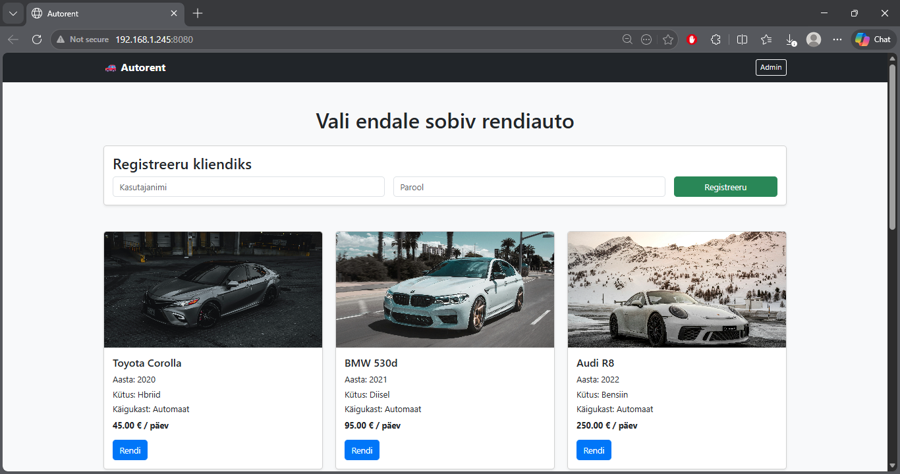
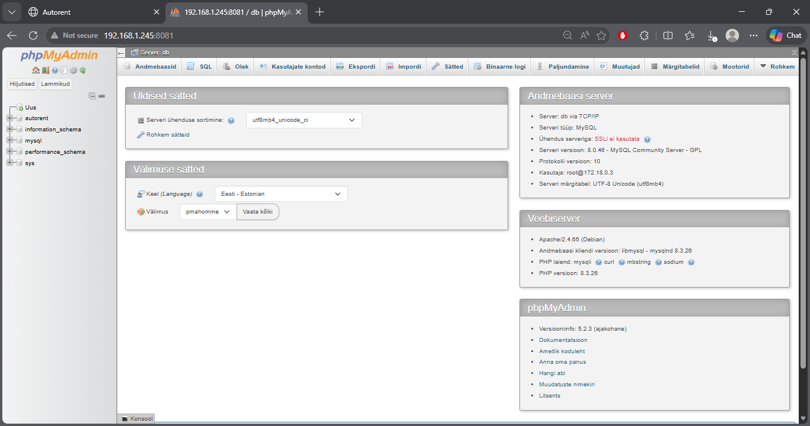
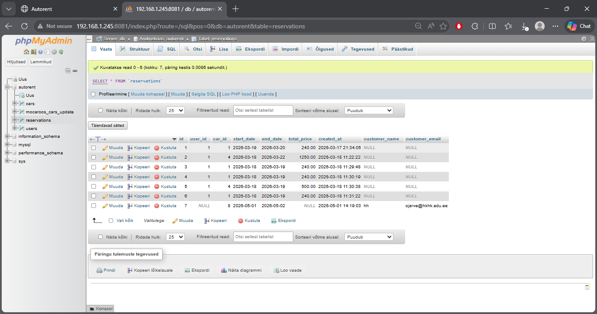

# 🚗 Autorendi veebirakendus

## 📌 Projekti kirjeldus
Tegemist on PHP ja MySQL baasil loodud autorendi veebirakendusega, kus kasutaja saab:
- vaadata autosid
- registreeruda
- rentida autot kindlaks ajavahemikuks

Rakenduses on olemas ka admin paneel, kus saab hallata autosid ja broneeringuid.

---

## ⚙️ Kasutatud tehnoloogiad
- PHP
- MySQL
- Docker
- phpMyAdmin
- Bootstrap

---

## 🚀 Käivitamine

Projekt on seadistatud Dockeriga ja töötab ühe käsuga:

```bash
docker-compose up --build
  
## 🌐 Ligipääs

http://localhost:8080
phpMyAdmin:
http://localhost:8081
Kasutaja: admin
Parool: Admin123!
Turvalisus

 - - -
Kasutatud  järgmised turvameetmed:

Paroolid salvestatakse räsitult (password_hash())
Sisselogimisel kasutatakse password_verify()
Andmebaasipäringutes kasutatakse prepared statements (SQL injection kaitse)
Väljundi kuvamisel kasutatakse htmlspecialchars() (XSS kaitse)
Kontrollitakse, et sama autot ei saa samaks ajavahemikuks mitu korda rentida
Emaili sisestus on valideeritud (filter_var)
Sessioon uuendatakse login (session_regenerate_id(true))

💡 Omapoolsed täiendused
Dockeriga lihtne käivitamine
Bootstrap kujundus
Admin paneel autode ja broneeringute haldamiseks
Broneeringu hind arvutatakse automaatselt päevade järgi
Lisatud kasutajasõbralikud veateated
Footer

## 📸 Tõestus

### Avaleht


### Admin paneel


### Andmebaas (tabelid)



